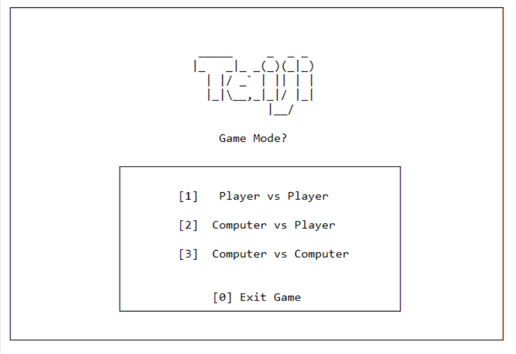
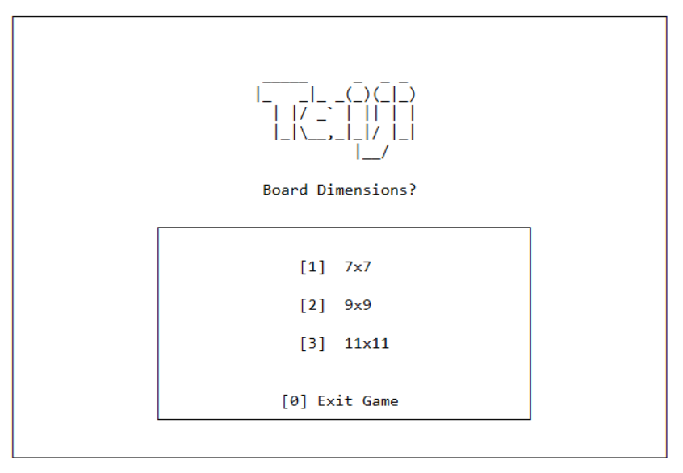
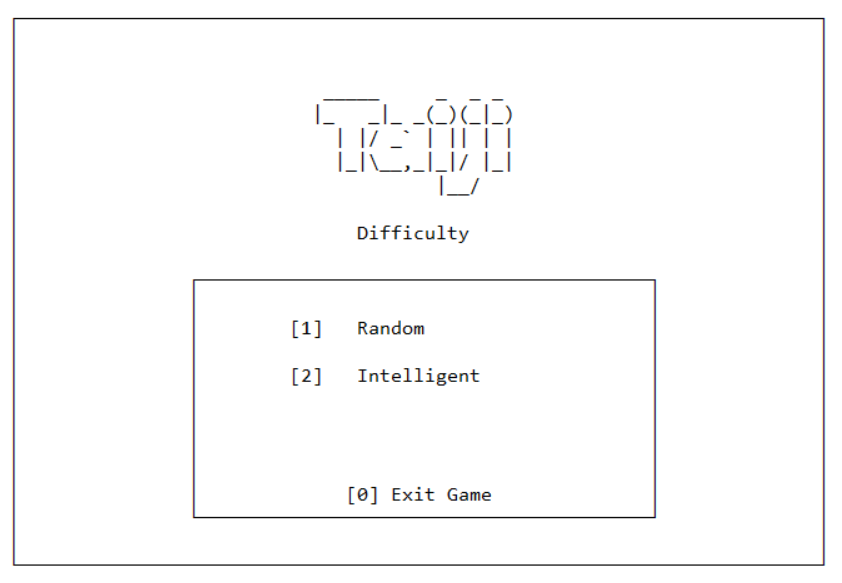
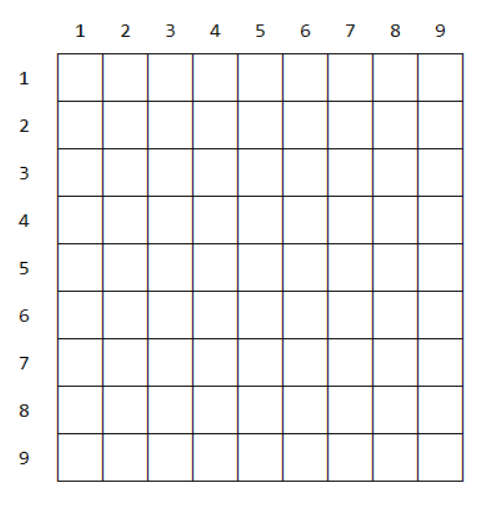
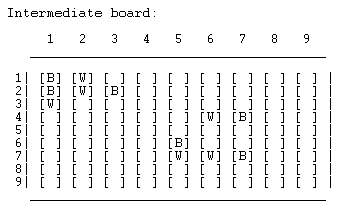
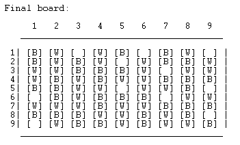

# Relatório Intermédio - PLOG

#### Jogo: Taiji
**Grupo**: Taiji_3
**Turma**: 6
**Professor**: Daniel Castro Silva
**Elementos**:
    - Diogo Samuel Gonçalves Fernandes (up201806250)
    - Paulo Jorge Salgado Marinho Ribeiro (up201806505)

---
## Índice

- [Instalação e Execução](#instalação-e-execução)
- [Descrição do jogo - Taiji](#descrição-do-jogo---taiji)
- [Lógica do Jogo](#lógica-do-jogo)
  - [Representação do Estado do Jogo](#representação-interna-do-jogo)
  - [Visualização do Estado do Jogo](#visualização-do-estado-do-jogo)
  - [Lista de Jogadas Válidas](#lista-de-jogadas-válidas)
  - [Execução de Jogadas](#execução-de-jogadas)
  - [Final do Jogo](#final-do-jogo)
  - [Avaliação do Tabuleiro](#avaliação-do-tabuleiro)
  - [Jogada do Computador](#jogada-do-computador)
- [Conclusões](#conclusões)
- [Bibliografia](#bibliografia)

---
## Instalação e Execução
### Windows
- Abrir o SICStus Prolog
- No menu Settings, escolher Font e selecionar tipo de letra Consolas.
- No menu File, escolher Consult e selecionar o ficheiro [main.pl](./main.pl)
- Executar o comando play. e jogar o jogo.

### Linux

---
## Descrição do jogo - Taiji

Taiji é um jogo de tabuleiro, cujo nome significa "Grande Dualidade" e representa a luta do Bem vs Mal, Luz vs Escuridão, YIN vs YANG. Este pode ter três dimensões diferentes, sendo elas 7x7, 9x9 ou 11x11.

O objetivo é obter o maior conjunto de quadrados conectados da cor do jogador em questão, colocando *Taijitus* no tabuleiro.

*Taijitus* são as peças do jogo. Cada peça contém uma parte preta e uma parte branca.  Isto acontece porque o Bem e o Mal são indivisíveis! Daí ambos os jogadores usarem as mesmas peças "duplas" indivisíveis.
Deste modo, cada vez que um *Taijitu* é jogado, são colocadas em tabuleiro ambas as cores, pelo que é possível estar a ajudar o jogo do seu oponente!

O jogador branco inicia o jogo e estes alternam de turno durante o jogo, a cada peça jogada.

Sempre que for a sua vez de jogar, o jogador deve colocar um *Taijitu* no tabuleiro, desde que haja espaço livre para fazê-lo. Um *Taijitu* só pode ser colocado em um espaço livre de 2 quadrados conectados. Um quadrado é considerado conectado a outro quadrado se for horizontal ou verticalmente adjacente (não diagonalmente).

O jogo termina quando não há espaço livre para colocar *Taijitus*. O jogador com a pontuação mais alta ganha o jogo. Para obter a sua pontuação, some o tamanho dos 'n' maiores grupos de sua cor, sendo 'n' o tipo de pontuação determinado na fase de configuração. Para determinar o tamanho de um grupo, basta contar os quadrados da mesma cor que o compõem. Em caso de empate, o jogador “Dark” vence.

> Regras Oficiais do jogo: https://nestorgames.com/rulebooks/TAIJI_EN4.pdf

--- 
## Lógica do Jogo
### Representação interna do jogo

O tabuleiro é representado como uma matriz de N colunas por N linhas, pelo que vamos representá-lo como uma lista de listas, sendo cada sublista uma linha do tabuleiro. A matriz inicial é obtida de forma dinâmica, da seguinte forma:

```prolog
% initial(N, M) -> creates the initial matrix M for the board, with dimensions N x N
initial(N, M) :- init_board(N, N, [], M).

init_board(0, _, M, M).
init_board(N, NC, MI, M) :-
    N > 0,
    N1 is N - 1,
    create_line(NC, [], L),
    init_board(N1, NC , [L|MI], M).

create_line(0, M, M).
create_line(N, MI, M) :-
    N > 0,
    N1 is N - 1,
    create_line(N1, [empty|MI], M).
```

Cada peça, denominada de *Taijitu* possui uma parte branca e preta, ocupando por isso duas casas do tabuleiro, uma para cada parte. Futuramente, cada peça vai ter o número da linha e coluna da parte branca da peça e a orientação (cima, direita, baixo, esquerda) de modo a conhecer a localização da parte preta. Identificamos as casas vazias com o caracter ' ' (espaço), as casas brancas com o caracter 'W' e as casas pretas com o caracter 'B'.

```prolog
% character(Name, Symbol) -> returns the Symbol for the cell with name Name
character(empty, ' ').
character(black, 'B').    
character(white, 'W').
```

#### Diferentes estados de jogo

O estado inicial de jogo vai ser uma matriz contendo apenas o valor empty, construída dinamicamente como foi referido acima.

Uma possível representação de um estado de jogo intermédio, com algumas peças colocadas, mas espaços livres para colocar novas peças, pode ser o seguinte:
```prolog
intermediateBoard([
    [black, white, empty, empty, empty, empty, empty, empty, empty],
    [black, white, black, empty, empty, empty, empty, empty, empty],
    [white, empty, empty, empty, empty, empty, empty, empty, empty],
    [empty, empty, empty, empty, empty, white, black, empty, empty],
    [empty, empty, empty, empty, empty, empty, empty, empty, empty],
    [empty, empty, empty, empty, black, empty, empty, empty, empty],
    [empty, empty, empty, empty, white, white, black, empty, empty],
    [empty, empty, empty, empty, empty, empty, empty, empty, empty],
    [empty, empty, empty, empty, empty, empty, empty, empty, empty]
]).
```
E uma representação final, em que já não é possível colocar mais nenhuma peça no tabuleiro, pode ser da seguinte forma:

```prolog
finalBoard([
    [black, white, empty, white, black, empty, black, white, empty],
    [black, white, black, white, empty, white, black, black, white],
    [white, white, black, black, black, white, empty, white, white],
    [white, black, white, black, white, white, black, black, black],
    [black, black, white, white, empty, white, white, black, empty],
    [empty, black, white, black, black, black, empty, white, white],
    [white, white, white, black, white, white, black, black, black],
    [black, black, black, white, white, black, white, black, empty],
    [empty, white, black, black, white, black, white, white, black]
]).
```

### Visualização do estado do jogo
 
As funções que estão responsáveis pela visualização encontram-se no ficheiro [display.pl](display.pl).

O predicado `play` começa inicialmente 

Posteriormente o predicado `display_game(Gamestate, Player)` é evocado, e este por sua vez chama `display_board(Gamestate)` seguido de `display_turn(Player)`. Desta forma, é apresentado o tabuleiro no estado recebido, e é indicado o jogador que deve jogar no turno. Posteriormente, serão adicionados aqui novos predicados, de maneira a receber e tratar os inputs dos jogadores.

O predicado `display_board` efetua a visualização do tabuleiro, tanto das suas casas como da grelha númerica que permite aos utilizadores identificarem cada casa. A função `print_numbers` é utilizada para a enumeração de 1 até N das linhas de jogo, `print_limits` é utilizada para a criação dos limites superior e inferior (usando o caracter '_') e `print_matrix` para a visualização da matriz de jogo.
```prolog
display_board(Gamestate, N) :-
    nl, write('     '), print_numbers(1, N), nl,
    write('   _'), print_limits(N * 4), nl, nl,
    print_matrix(Gamestate, 1, N),
    write('   _'), print_limits(N * 4),  nl, nl.
```

#### Exemplos
Apresentam-se agora exemplos da visualização dos menus e de três estados de jogo diferentes num tabuleiro 9x9:

| Menu Inicial | Escolha de tabuleiro | Dificuldade do Bot |
| ------------- | ------------------ | ----------- |
|  |  |  |

Existem outros menus, dependendo da opção que o jogador escolheu inicialmente.

| Tabuleiro Inicial | Tabuleiro Intermédio | Tabuleiro Final |
| ------------- | ------------------ | ----------- |
|  |  |  |


### Lista de Jogadas Válidas -- TO DO

Para determinar se uma posição é válida é necessário verificar a mesma não se encontrar ocupada por nenhuma outra peça no tabuleiro. Como no nosso jogo *Taiji* uma peça ocupa duas casas é preciso garantir que ambas as casas se encontram livres.

Para essa validação de jogadas foi utilizado o predicado `valid_move(L, C, O, CurrentBoard)`.
?? Explicar como get_value e orientation funcionam ??

A obtenção de todas as jogadas válidas é feita com o predicado `valid_moves(GameState, _, ListOfMoves)`. Vai ser retornada em ListOfMoves todas as jogadas válidas, que são obtidas a partir da utilização do seguinte do predicado`findall(L-C-O, (member(O, [up, down, left, right]), member(L, RangeList), member(C, RangeList), valid_move(L, C, O, GameState)), ListOfMoves)`.

### Execução de Jogadas -- TO DO

Para a execução do jogo, utilizamos um ciclo que está responsável por executar as jogadas de cada jogador. 

```prolog
nl, initial(N, InitialBoard), assert(state(white, InitialBoard)),
    repeat,
        retract(state(Player, CurrentBoard)),
        display_game(CurrentBoard, Player),
        makeMove(Player, CurrentBoard, NextPlayer, NextBoard, player),
        assert(state(NextPlayer, NextBoard)),
        game_over(NextBoard, Winner-Number),
    showResult(Winner, Number),
    !.
```

O predicado `makeMove` vai inicialmente pedir o input do jogador *Player* e *CurrentBoard* para este escolher a posição onde quer colocar a peça. Após o jogador escolher a posição da peça, a posição escolhida vai ser verificada e se for válida o predicado `move(CurrentBoard, L-C-O-Color, NextBoard)` vai ser invocado. Este tem como função alterar o *CurrentBoard* e retornar em *NextBoard* o novo tabuleiro de jogo, já com o *Taijitu* na posição escolhida pelo jogador.

### Final do Jogo -- TO DO

O jogo *Taiji* termina quando não existe mais nenhuma jogada possível. Quando isto ocorre o predicado `endOfGame` vai ter sucesso e vai ser obtido o vencedor do jogo. 

O vencedor do jogo é calculado com o auxilio da função `calculateWinner` que vai obter o maior grupo de peças brancas e o maior número de peças pretas. Posteriormente vai ser calculado qual dos dois grupos é o maior. O vencedor é aquele que tiver o maior grupo.

Caso os grupos possuam o mesmo tamanho, o jogador preto é o vencedor, uma vez que é o branco que começa o jogo.


### Avaliação do Tabuleiro -- TO DO
O nosso predicado `value(Board, Color, NumberColor)` vai avaliar o tabuleiro e retornar em `NumberColor` o valor do maior grupo da cor `Color`, sendo auxiliada do predicado `calculateLargestGroup` que vai encontrar o maior grupo da mesma cor no tabuleiro.


### Jogada do Computador -- TO DO

Quando o jogador deseja jogar contra o computador ou apenas visualizar dois computadores a jogar entre si, este pode escolher dois níveis de dificuldade distintos.

- Nível de dificuldade aleatório, em que o computador escolhe uma jogada entre uma das jogadas válidas.
- Nível de dificuldade ganancioso, em que o computador tenta a cada jogada maximizar a sua pontuação atual, isto é, aumentar o seu maior grupo.

No caso do jogo em dificuldade aleatória é invocado o predicado `choose_move(GameState, Player, random, L-C-O)` em que apenas irá ser escolhida uma jogada aleatória da lista de jogadas válidas obtida através do predicado `valid_moves`. 

O nível de dificuldade ganancioso é invocado pelo predicado `choose_move(GameState, Player, intelligent, L-C-O)` em que o computador irá calcular o valor do tabuleiro após cada uma das jogadas possíveis utilizando o predicado `calculateValueMove(GameState, Color, RangeList, PossibleMoves, ValueMove)`. São escolhidas então as jogadas que mais beneficiam o computador através do predicado `select_best_moves`. Quando os melhores movimentos estiverem determinados, o computador escolhe um deles aleatóriamente (uma vez que todos os movimentos vão trazer o mesmo incremento de pontuação para o computador).

## Conclusões  -- TO DO

O projeto teve como principal objetivo aplicar aquilo que aprendemos quer durante as aulas teóricas como práticas e permitiu a implementação de um jogo de tabuleiro para dois jogadores na linguagem PROLOG. Ao  longo  do  desenvolvimento  deste  projeto,  encontramos  algumas dificuldades que foram superadas quer com a ajuda do professor quer com recurso a informação existente online.

A elaboração deste trabalho permitiu-nos ainda aperfeiçoar o nosso conhecimento e destreza em  programação lógica que até este semestre era inexistente.
Também aprendemos a ter um melhor raciocinio recursivo, uma vez que esta é uma das bases da programação lógica.

O trabalho  foi  concluído  com  bastante sucesso,  e  o  seu  desenvolvimento contribuiu para melhorarmos e aprofundarmos o conhecimento desta linguagem de programação.

---
## Bibliografia

- [https://nestorgames.com/rulebooks/TAIJI_EN4.pdf](https://nestorgames.com/rulebooks/TAIJI_EN4.pdf)